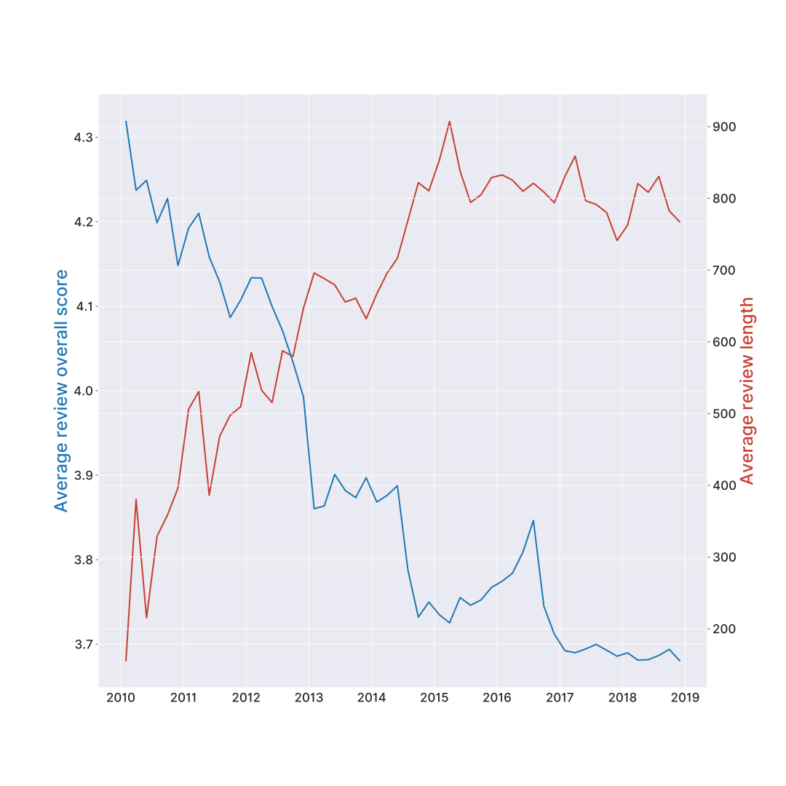
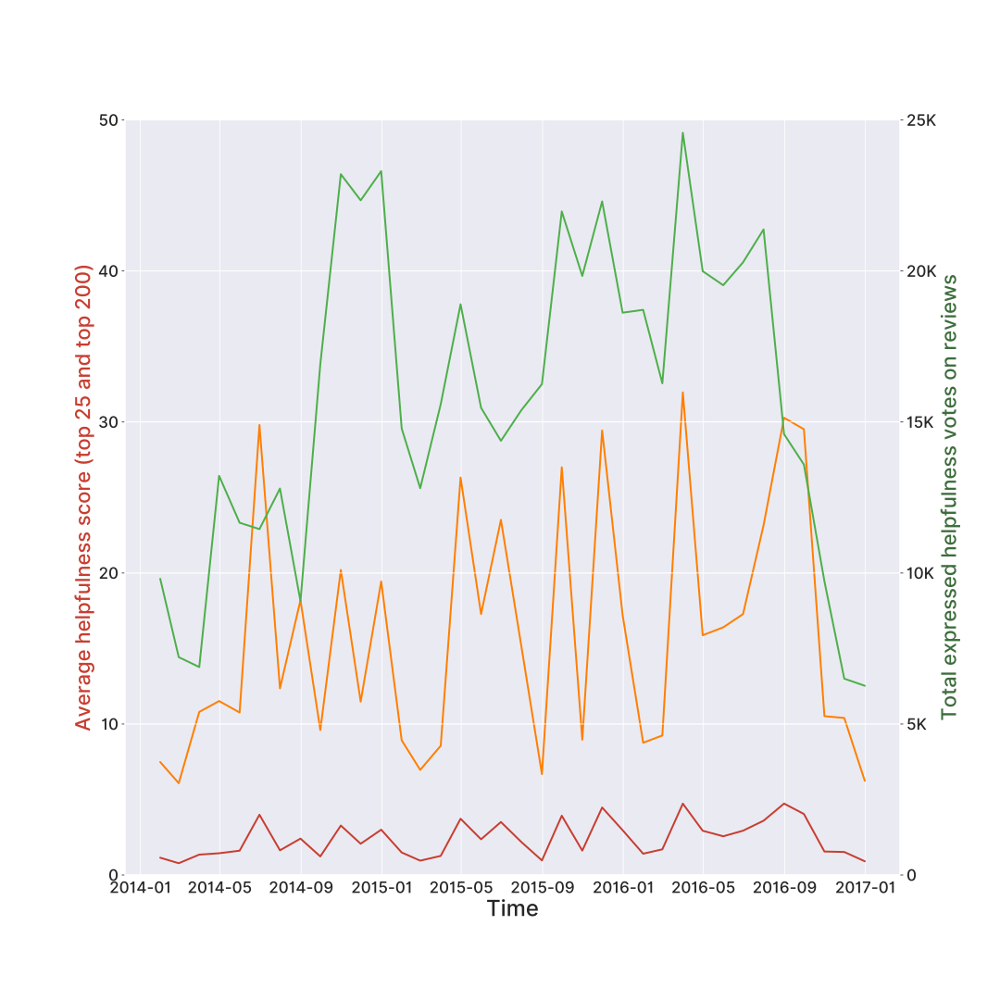
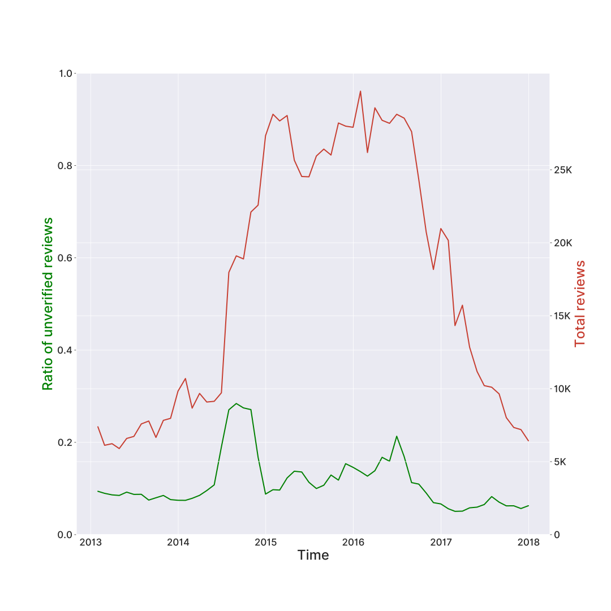
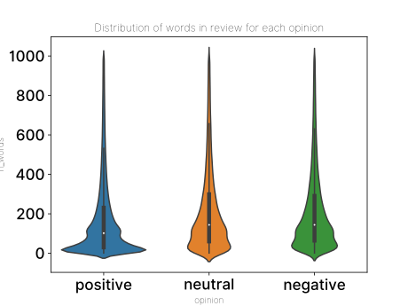

# Analytics on Amazon Reviews

Data Analytics exam final project, MSc in Computer Science.

By [Matteo Coppola](https://github.com/matteocoppola), [Luca Palazzi](https://github.com/lucapalazzi), [Antonio Vivace](https://github.com/avivace).

> Exploration, Sentiment Analysis, Topic Analysis (LDA) and a VueJS web application exposing the trained models.

[Documentation](report.pdf)

[Web app demo deployment](https://avivace.github.io/reviews-sentiment)

#### Exploration





#### Web demo


## Run

Set up the a Python virtual environment and install required packages

```bash
# run this as sudo if it doesn't work
python3 -m spacy download en

cd scripts
python3 -m venv .
source bin/activate
pip3 install -r requirements.txt
```

Optionally, install a ipynb kernel to use the venv packages
```bash
pip3 install --user ipykernel
python -m ipykernel install --user --name=myenv
# Check the installed kernels
jupyter kernelspec list
# Run Jupyter
jupyter lab
```


Now, to run the full pipeline:
```bash
python3 main.py
```

A Flask application exposes a simple API (on port 5000) allowing the trained models to be used on demand via simple HTTP requests (in main.py). The VueJS application needs a recent version of NodeJS and npm.

```bash
cd webapp
npm install
# serve the web application with hot reload
npm run serve
# builds the web application for production
npm run build
# deploys the build on the master branch, making github serve it on https://avivace.github.io/reviews-sentiment
npm run deploy
```


Antuz notes: accent is `#B71C1C`, typeface is *Barlow* 500. On the plots and graphs, typeface is *Inter* 600, palette is `#4DAF4A`, `#FF7F00`, `#C73E31`.
